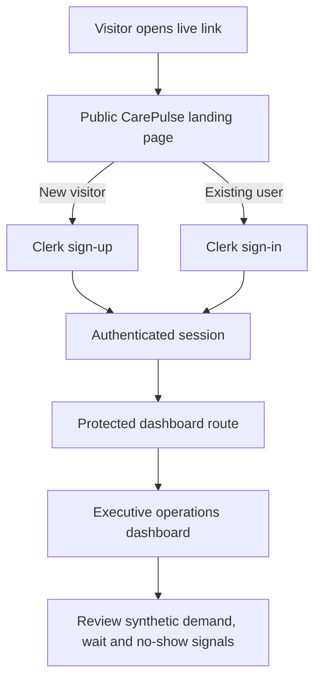

# CarePulse AI — Project Report

> **Live application:** [https://carepulse-ai-flame.vercel.app](https://carepulse-ai-flame.vercel.app)  
> **Source repository:** [github.com/cosmosandyou/carepulse-ai](https://github.com/cosmosandyou/carepulse-ai)

## 1. Project purpose

CarePulse AI is a privacy-safe healthcare-operations analytics portfolio project based on a fictional Dublin clinic network. It demonstrates how appointment activity can be converted into useful planning signals: demand pressure, no-show risk, waiting-time pressure, and clinic-access patterns.

It uses **synthetic data only**. It is not connected to real healthcare records, is not a clinical decision-support system, and must never be used to make diagnosis, treatment, or individual patient-care decisions.

## 2. What was built — step by step

### 1. Define a safe problem

The project was scoped around operational planning rather than clinical care. The core questions were:

- Where might appointment demand create capacity pressure?
- Which appointments are more likely to be missed?
- Which specialties and clinics show longer waits?
- Which practical actions could an operations team review?

This scope is important: the output is an aid for human operations discussion, not automated decision-making.

### 2. Create realistic synthetic data

The Python prototype in `app.py` creates 18,000 deterministic synthetic appointment records. A fixed random seed means the demonstration is repeatable.

The data includes appointment date, clinic, specialty, age band, appointment type, referral source, travel distance, previous missed appointments, reminder status, weather flag, waiting time, and a synthetic no-show outcome. Six fictional Dublin-area clinics are included: Tallaght, Blanchardstown, North Dublin, Rathmines, Sandyford, and Clontarf.

These fields and relationships are designed to make the dashboard meaningful to explore. They are not measurements of actual patients, clinics, or services.

### 3. Build the Streamlit analytics prototype

The original interactive application is a local Python/Streamlit app. It lets an analyst filter by clinic, specialty, and appointment period, then view:

- **Executive overview:** KPIs, appointment trend, clinic summary, and an operations briefing.
- **Clinic demand:** a simple five-working-day demand estimate and pressure band.
- **No-show risk:** model discrimination, risk comparisons, and operational risk drivers.
- **Waiting times & access:** specialty waiting-time analysis and a Dublin hotspot map.

The app uses pandas/NumPy to generate and transform data, Plotly for visualisation, and scikit-learn for the demonstration no-show model.

### 4. Add predictive demonstration logic

A `RandomForestClassifier` is trained on synthetic features: travel distance, previous missed appointments, reminder status, weather, wait time, Monday appointments, and follow-up appointments.

It produces a synthetic no-show probability and groups appointments into low, medium, and high-risk bands. AUC is shown as an internal test on held-out synthetic data. It is **not** proof that the model would perform well with real healthcare data.

The next-week demand forecast is deliberately transparent and simple: average daily demand is scaled to five working days and adjusted with a clinic-pressure factor. It is a portfolio heuristic, not a production time-series forecast.

### 5. Build a public web application

A separate Next.js app was added in `web/` so visitors can access CarePulse from a normal browser link instead of needing to run Streamlit locally.

It includes a public landing page, sign-in and sign-up routes, a protected executive dashboard, and a health endpoint. The visual design explains the product goal, privacy boundary, and high-level analytics signals.

### 6. Add public authentication

Clerk was configured to allow public self-service sign-up. New visitors can create an account, and returning users can sign in.

The middleware leaves these routes public:

- `/`
- `/sign-in/*`
- `/sign-up/*`
- `/api/health`

Other application routes, including `/dashboard`, require an authenticated Clerk session. Real Clerk secrets are held in Vercel environment variables and are not committed to GitHub.

### 7. Deploy to Vercel

The Next.js web application was deployed to Vercel. The live application is:

**[https://carepulse-ai-flame.vercel.app](https://carepulse-ai-flame.vercel.app)**

Vercel hosts and builds the web app; Clerk manages authentication; GitHub stores the public source and documentation.

## 3. User flow



For the local analytics prototype, the analyst runs Streamlit, selects filters, and the Python process generates synthetic records, trains/scores the model, and renders the charts in the same process.

## 4. Architecture

```mermaid
flowchart LR
    U[User] --> V[Vercel-hosted Next.js app]
    V --> P[Public landing page]
    V --> M[Clerk middleware]
    M -->|Authenticated| D[Protected dashboard]
    M -->|Not authenticated| C[Clerk sign-in or sign-up]
    C --> M
    V --> H[/api/health]

    A[Local analyst] --> S[Streamlit prototype]
    S --> X[Synthetic appointment generator]
    X --> R[Random Forest no-show model]
    R --> Q[KPIs, plots, map and briefing]
```

| Layer | Responsibility | Current state |
|---|---|---|
| `app.py` | Synthetic data, analytics and model demonstration | Runs locally via Streamlit |
| `web/` | Public product-style UI and protected dashboard | Hosted on Vercel |
| Clerk | Sign-up, sign-in, sessions and route protection | Hosted service |
| Vercel | Build and web hosting | Hosted service |
| GitHub | Public source and documentation | Public repository |

### Important architecture note

The deployed Next.js dashboard currently displays curated **fixed synthetic values**. It does not yet call the Python model or read a live database. The Streamlit prototype contains the real demonstration analytics logic. Connecting these two layers is the main future integration task.

## 5. Technology stack

| Area | Technology | Purpose |
|---|---|---|
| Analytics prototype | Python, Streamlit | Fast interactive data application |
| Data processing | NumPy, pandas | Reproducible synthetic data and transformations |
| Model | scikit-learn Random Forest | No-show-risk demonstration |
| Charts and mapping | Plotly | Interactive charts and OpenStreetMap-based map |
| Public web app | Next.js 15, React 19, TypeScript | Browser experience and routing |
| Styling | CSS | Responsive dashboard and landing page |
| Authentication | Clerk | Hosted identity and session management |
| Hosting | Vercel | Managed Next.js deployment |
| Source control | GitHub | Public source and documentation |

## 6. Data, model and recommendations

The synthetic data intentionally encodes plausible operational relationships. For example, prior missed appointments, no reminder, Monday slots, longer travel distance, and a weather flag increase the simulated no-show probability. Waiting time varies by specialty, clinic pressure, and season.

The dashboard turns those patterns into human-review suggestions: target reminders, review Monday capacity, consider remote/nearby alternatives, and retain a tightly controlled low-risk overbooking buffer. These are planning ideas only; they must not automatically change an individual's access to care.

## 7. Privacy and security

- All records are synthetic.
- The live dashboard requires a user account after the public landing page.
- `NEXT_PUBLIC_CLERK_PUBLISHABLE_KEY` and `CLERK_SECRET_KEY` are configured in Vercel.
- Only placeholder values belong in `.env.example`.
- Real secret keys must never be committed, shared, or placed in the README.

## 8. Limitations

1. **Synthetic data only:** results say nothing about actual Dublin services or people.
2. **No live data pipeline:** the hosted dashboard does not yet connect to a database or Python API.
3. **Simplified validation:** no external validation, calibration, fairness study, monitoring, or governance review exists.
4. **Heuristic forecasting:** the demand estimate does not account for staffing, holidays, cancellations, seasonality, or real events.
5. **No role-based permissions:** every authenticated user sees the same synthetic dashboard.
6. **No audit workflow:** there are no saved decisions, intervention logs, alert acknowledgements, or permissioned exports.
7. **Not compliance-ready:** a real healthcare deployment would require privacy, security, accessibility, legal, and clinical-safety assessment.
8. **Not a Play Store app yet:** the website is responsive, but it is not an Android native package.

## 9. How to run it locally

### Analytics prototype

```powershell
python -m pip install -r requirements.txt
streamlit run app.py
```

### Web app

```powershell
cd web
npm install
Copy-Item .env.example .env.local
npm run dev
```

Add real Clerk values only to `web/.env.local` for local development and to Vercel for deployment:

```text
NEXT_PUBLIC_CLERK_PUBLISHABLE_KEY=...
CLERK_SECRET_KEY=...
```

## 10. Recommended next steps

1. Put the Python model behind a FastAPI service with authenticated, read-only analytics endpoints.
2. Replace fixed Next.js dashboard values with API-driven aggregated synthetic data.
3. Add PostgreSQL for approved, de-identified operational aggregates.
4. Add roles such as analyst, manager, and administrator.
5. Add forecast back-testing, calibration, data-quality checks, and monitoring.
6. Add audit logs, retention policies, access reviews, and accessibility testing.
7. If Play Store distribution is needed, package the responsive web app using Capacitor or build a React Native app, then complete Google Play policy and privacy requirements.

## 11. Summary

CarePulse AI is a privacy-safe healthcare-operations portfolio project: a local synthetic-data and modelling prototype combined with a publicly accessible, Vercel-hosted, Clerk-authenticated web experience.
